# How to reconstruct the seasonal patterns from a time-differenced, non-stationary time-series using machine learning
#### by Rohan Kotwani

The original problem statement was given here: http://www.datasciencecentral.com/forum/topics/challenge-of-the-week-identifying-patterns-in-complex-time-series

There was also a verbal solution given in the members only section. I'm not sure if its legal to share the whole thing, but here is an excerpt of the solution. " The time series has a weekly periodicity with two peaks: Monday and Thursday, corresponding respectively to the publication of the Monday and Thursday digests. The impact of the Monday and Thursday email blasts extent over the next day; this makes measuring the yield more difficult, unless you use additional data, e.g. from our newsletter vendor. However, the bulk of the impact is really on Monday and Thursday."

I saw a DSC article that talked about finding trends using signal processing techniques. http://www.datasciencecentral.com/profiles/blogs/how-we-combined-different-methods-to-create-advanced-time-series . The trend component could be created and entered into the regression model as an independent variable. I should the trend component in one of the figures above. I think it wouldn't make sense to reuse frequencies components from the trend component because their periods (cycles/seconds) are very large (upwards of 200 days).

The trend and seasonality can be accounted for in a linear model by including sinusoidal components with a given frequency. However, finding the appropriate frequency for each sinusoidal component requires a little more digging. This post shows how to use Discrete Fourier transforms to find these frequencies.

#### The basic idea

* N point discrete Fourier transform formula


1. k ∈ [0,N-1] or k ∈ [−N/2, N/2−1] or k ∈ [−(N−1)/2, (N−1)/2]
2. N = # of data points
3. n = rank order of input data points
4. k = rank order of output data points

#### Assumptions

"The Fourier transform assumes that the signal is stationary and that the signals in the sample continue into infinity. The Fourier transform performs poorly when this is not the case."

A stationary process has a constant mean and variance over time which is a property that the time series doesn't have. A stationary process can be extracted from the time series by creating a time differenced variable. However, the complex magnitudes from the time difference variable does not represent the actual signal. A regression model can then be used to recontruct the magnitudes of this signal.

#### Defining the model:
y = T(t) + S(t) + R(t)

* T(t)~Trend component
* S(t)~Seasonal component
* R(t)~Residual error

For the purposes of this post, we will only focus on the T(t) and S(t) components. 80% of the data or 584 observations were used to create the training set. The model was validated on the remaining 146 observations.


```python
import pandas as pd
import numpy as np
import matplotlib.pyplot as plt
import datetime

full=pd.read_csv("Images/DSC_Time_Series_Challenge.csv",dtype = {'Day ':str,'Sessions':int,'Pageviews':int})
time=[datetime.datetime.strptime(t[0],"%m/%d/%y") for t in full[['Day ']].values]
weekday=[datetime.datetime.strptime(t[0],"%m/%d/%y").isocalendar()[2] for t in full[['Day ']].values]

full['time']=time
full['index']=np.arange(1,len(full)+1)
full['weekday']=weekday
full=full.sort_values(by=['time'])

train=full[:584].copy()
valid=full[584:].copy()
train.head(n=5)

plt.plot(full['index'],full['Pageviews'],'-')
plt.xlabel('time')
plt.ylabel('Pageviews')
plt.show()

full.head()
```


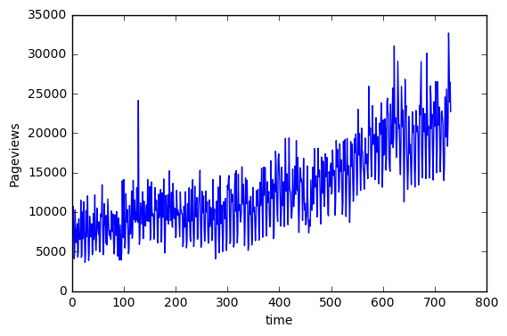


<div>
<table border="1" class="dataframe">
  <thead>
    <tr style="text-align: right;">
      <th></th>
      <th>Day</th>
      <th>Sessions</th>
      <th>Pageviews</th>
      <th>time</th>
      <th>index</th>
      <th>weekday</th>
    </tr>
  </thead>
  <tbody>
    <tr>
      <th>0</th>
      <td>9/25/13</td>
      <td>4370</td>
      <td>7177</td>
      <td>2013-09-25</td>
      <td>1</td>
      <td>3</td>
    </tr>
    <tr>
      <th>1</th>
      <td>9/26/13</td>
      <td>5568</td>
      <td>10760</td>
      <td>2013-09-26</td>
      <td>2</td>
      <td>4</td>
    </tr>
    <tr>
      <th>2</th>
      <td>9/27/13</td>
      <td>4321</td>
      <td>8171</td>
      <td>2013-09-27</td>
      <td>3</td>
      <td>5</td>
    </tr>
    <tr>
      <th>3</th>
      <td>9/28/13</td>
      <td>2378</td>
      <td>4093</td>
      <td>2013-09-28</td>
      <td>4</td>
      <td>6</td>
    </tr>
    <tr>
      <th>4</th>
      <td>9/29/13</td>
      <td>2612</td>
      <td>4881</td>
      <td>2013-09-29</td>
      <td>5</td>
      <td>7</td>
    </tr>
  </tbody>
</table>
</div>


#### The weekday variable will be dummy coded and used later to compare results


```python
weekday_dummies = pd.get_dummies(train.weekday, prefix='W').iloc[:, 1:]
train = pd.concat([train, weekday_dummies], axis=1)
weekday_dummies = pd.get_dummies(valid.weekday, prefix='W').iloc[:, 1:]
valid = pd.concat([valid, weekday_dummies], axis=1)
```

#### Custom Libaries


```python
import Regression
import DSP
```

#### Finding the overall trend:

A polynomial term can be used to represent the trend component T(t) which can be created from the index variable. The complexity of the trend component can be tuned by using a training and validation set to find optimal complexity with the lowest sum of squared errors. A complexity of degree 2 had the lowest SSE value on the validation set so these terms will be included in the model.


```python
heap = []
for i in range(1,15):
    z=Regression.sklearn_poly_regression(train[['index']],train[['Pageviews']],i)
    SSE = Regression.numpy_poly_regression_SSE(valid[['index']],valid[['Pageviews']],i,z)
    heap.append((SSE,i))
Regression.heapsort(heap)
```


    [(2439879011.916925, 2),
     (3174625477.7490239, 11),
     (3199921635.4631476, 14),
     (3228657253.80269, 12),
     (3243036097.6879435, 10),
     (3247262823.0314054, 13),
     (3439863169.0826645, 9),
     (4276247432.3428478, 1),
     (4290126891.6970415, 8),
     (5901317555.359643, 4),
     (6361004811.9196491, 3),
     (15168127670.713562, 5),
     (306887053477.06006, 7),
     (434993076221.19543, 6)]


```python
train['sq_index'] = train['index']**2
valid['sq_index'] = valid['index']**2
```

#### Removing the overall trend:

First, the overall trend needs to be removed from the signal in order to statisfy the stationary process assumption. This can be accomplished by creating a lag 1 differenced variable for Pageviews. This differenced variable will also make seasonal components easier to find.


```python
time_diff_signal = DSP.time_diff_variable(train['Pageviews'],1)

plt.plot(train['index'][1:],time_diff_signal,'-')
plt.xlabel('time')
plt.ylabel('Pageviews[t] - Pageviews[t-1]')
plt.show()
```


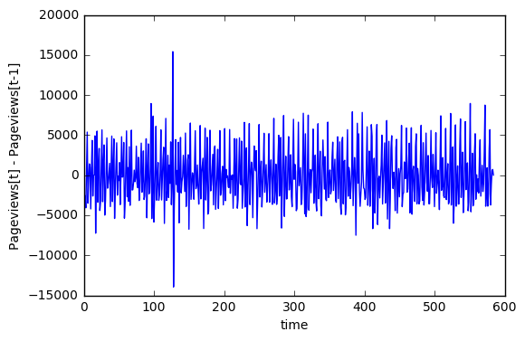


#### The FFT transformation:

Taking the FFT of the time differenced signal creates a complex magnitude representation for each sinusoidal frequency component in the signal. 

The data is filtered to include only the dominant sinusodial frequency components. Usually, the complex magnitude can be used to find the phase and absolute magnitude of the sinusodial wave corresponding to each frequency. In this case, we are using a time difference variable so the magnitudes and phases are not representative of the actual variable.

This process can be semi-automated by using statistics. The center frequency can be found by average across all frequencies. The bandwidth of the filter can be defined by frequencies within to standard deviations of the mean of the absolute complex magnitude. The purpose of this is avoid periods that are too large.


```python
N = len(time_diff_signal)
unfiltered  = DSP.get_frequency_domain(time_diff_signal)
y_abs=( 2.0/N * np.abs(unfiltered[1:,1]))
threshold = np.mean(y_abs)+2*np.std(y_abs)
print("Absolute magnitude threshold: ", threshold)

plt.plot(unfiltered[1:,0],y_abs)
plt.title("pageviews: frequency domain")
plt.show()


center = np.mean(unfiltered[1:,0])
band = 1*np.std(unfiltered[1:,0])
print("Center frequency: ",np.abs(center),"Band: ",np.absolute(band))


print("Frequency, Magnitude")
abs_filtered = np.absolute(DSP.filter_freq_domain(unfiltered, center,band,1000))
print(abs_filtered)
```

    Absolute magnitude threshold:  640.530604846


    /Users/rohankotwani/anaconda/envs/datasci/lib/python3.5/site-packages/numpy/core/numeric.py:531: ComplexWarning: Casting complex values to real discards the imaginary part
      return array(a, dtype, copy=False, order=order)


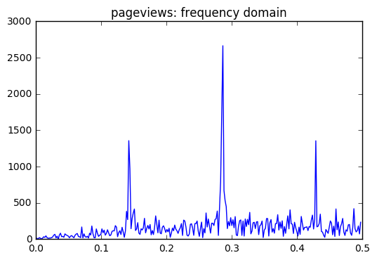


    Center frequency:  0.249571183533 Band:  0.143593981673
    Frequency, Magnitude
    [[  1.42367067e-01   3.95717180e+05]
     [  2.84734134e-01   5.06308893e+05]
     [  2.86449400e-01   7.76821349e+05]]


#### Creating predictor variables

After filtering the data, the dominant frequencies were found at .143, .28, and .29. These correspond to T=7,4, and 3, respectively. Sequences with these periods can be created. 

Notice that the frequency .428, that corresponds to a period of 2 (actually a little below), was not included in our predictors. This is because of Nyquist's thoeorm:

* "When the signal bandlimited to ½ fs cycles/second (hertz), its Fourier transform, X(f), is 0 for all |f| > 1/2*(1/T)"


In this case the signal has a sampling period of 1 or a sampling frequency of 1. The maximum frequency we can "see," by Nyquist's theorm, would be a signal with a period greater than 2. 


```python
period_list = set([round(1/(ft)) for ft,ht in abs_filtered if int(1/(ft))>2])
print("Sequence list: ",period_list)

train = DSP.get_sequences(train,period_list,plot=True)
valid = DSP.get_sequences(valid,period_list,plot=False)
```

    Sequence list:  {3.0, 4.0, 7.0}


    /Users/rohankotwani/anaconda/envs/datasci/lib/python3.5/site-packages/numpy/core/numeric.py:531: ComplexWarning: Casting complex values to real discards the imaginary part
      return array(a, dtype, copy=False, order=order)


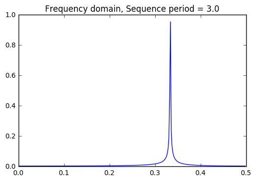


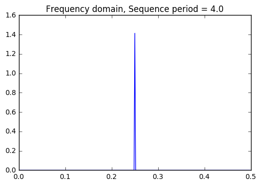


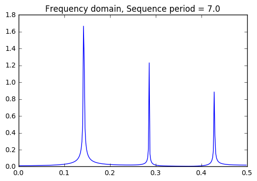


#### Eureka! Weekday (Sequence period = 7) shares the same frequency components as Pageviews!

The table below shows the index and weekday to help illustrate what the periods or cycles.  The index starts at 1, but this corresponds to weekday 3 (or Wednesday). So index 6 corresponds to Monday and index 2 corresponds to Thursday.


```python
train.head()
```


<div>
<table border="1" class="dataframe">
  <thead>
    <tr style="text-align: right;">
      <th></th>
      <th>Day</th>
      <th>Sessions</th>
      <th>Pageviews</th>
      <th>time</th>
      <th>index</th>
      <th>weekday</th>
      <th>W_2</th>
      <th>W_3</th>
      <th>W_4</th>
      <th>W_5</th>
      <th>W_6</th>
      <th>W_7</th>
      <th>sq_index</th>
      <th>seq_3.0</th>
      <th>seq_4.0</th>
      <th>seq_7.0</th>
    </tr>
  </thead>
  <tbody>
    <tr>
      <th>0</th>
      <td>9/25/13</td>
      <td>4370</td>
      <td>7177</td>
      <td>2013-09-25</td>
      <td>1</td>
      <td>3</td>
      <td>0.0</td>
      <td>1.0</td>
      <td>0.0</td>
      <td>0.0</td>
      <td>0.0</td>
      <td>0.0</td>
      <td>1</td>
      <td>1.0</td>
      <td>1.0</td>
      <td>1.0</td>
    </tr>
    <tr>
      <th>1</th>
      <td>9/26/13</td>
      <td>5568</td>
      <td>10760</td>
      <td>2013-09-26</td>
      <td>2</td>
      <td>4</td>
      <td>0.0</td>
      <td>0.0</td>
      <td>1.0</td>
      <td>0.0</td>
      <td>0.0</td>
      <td>0.0</td>
      <td>4</td>
      <td>2.0</td>
      <td>2.0</td>
      <td>2.0</td>
    </tr>
    <tr>
      <th>2</th>
      <td>9/27/13</td>
      <td>4321</td>
      <td>8171</td>
      <td>2013-09-27</td>
      <td>3</td>
      <td>5</td>
      <td>0.0</td>
      <td>0.0</td>
      <td>0.0</td>
      <td>1.0</td>
      <td>0.0</td>
      <td>0.0</td>
      <td>9</td>
      <td>0.0</td>
      <td>3.0</td>
      <td>3.0</td>
    </tr>
    <tr>
      <th>3</th>
      <td>9/28/13</td>
      <td>2378</td>
      <td>4093</td>
      <td>2013-09-28</td>
      <td>4</td>
      <td>6</td>
      <td>0.0</td>
      <td>0.0</td>
      <td>0.0</td>
      <td>0.0</td>
      <td>1.0</td>
      <td>0.0</td>
      <td>16</td>
      <td>1.0</td>
      <td>0.0</td>
      <td>4.0</td>
    </tr>
    <tr>
      <th>4</th>
      <td>9/29/13</td>
      <td>2612</td>
      <td>4881</td>
      <td>2013-09-29</td>
      <td>5</td>
      <td>7</td>
      <td>0.0</td>
      <td>0.0</td>
      <td>0.0</td>
      <td>0.0</td>
      <td>0.0</td>
      <td>1.0</td>
      <td>25</td>
      <td>2.0</td>
      <td>1.0</td>
      <td>5.0</td>
    </tr>
  </tbody>
</table>
</div>


#### Fitting the Model

Since T(t) is already created, this part of the blog will focus on S(t). 

Each seasonal component is made up of two sinusoidal waves, i.e. β1sin(t/T) + β2cos(t/T). The cosine term is include to account for phase shift. The beta coefficients are the estimated parameter weights for each sinusoid. 

There are 3 sequences included in the model each with a unique t, time index. A period, T, or periods can be used for each sequence. These periods can be found using the same semi-automated techniques used to generate the sequences as described earlier. The threshold can be adjust by the number of standard deviations from the mean of the absolute complex magnitude.


```python
output=train[['Pageviews']]
y=output.values

m,n =np.shape(output)
count=0

train_x = np.ones((len(train),1))
valid_x = np.ones((len(valid),1))

for component in period_list:
    var_name = "seq_"+str(component)
    f=DSP.get_sequence_freq(var=train[[var_name]],std_thresh=2,plot=True)
    x=DSP.get_seasonal_predictors(train[[var_name]],f)
    train_x=np.column_stack((train_x,x))
    x=DSP.get_seasonal_predictors(valid[[var_name]],f)
    valid_x=np.column_stack((valid_x,x))
    count+=1
plt.plot(train['index'][:60],train['Pageviews'][:60],'-')
plt.title("Values")
plt.show()

x=train_x

A=x.T.dot(x)
b=x.T.dot(y)
z = np.linalg.solve(A,b)

SSE=np.sum((y-x.dot(z))**2)
print("SSE :",SSE)
print("Baseline: ",sum((y-np.mean(y))**2)[0])

# plt.plot(train['index'],y,'.') 
plt.plot(train['index'][:60],x.dot(z)[:60],'-')
plt.title("Weighted Addition of Seasonal Components")
plt.show()
print("coefficients: ")
print(z)
```

    threshold 0.147628424524
    frequencies  [[  0.00000000e+00   5.85000000e+02]
     [  3.30479452e-01   5.60580464e+01]
     [  3.32191781e-01   1.39709001e+02]
     [  3.33904110e-01   2.78551085e+02]
     [  3.35616438e-01   6.94223955e+01]]


    /Users/rohankotwani/anaconda/envs/datasci/lib/python3.5/site-packages/numpy/core/numeric.py:531: ComplexWarning: Casting complex values to real discards the imaginary part
      return array(a, dtype, copy=False, order=order)


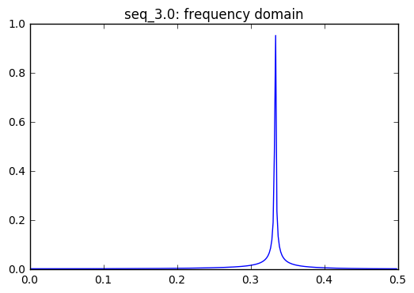


    frequencies used in  seq_3.0  :  [0.33333333333333331]
    frequencies used in  seq_3.0  :  [0.33333333333333331]
    threshold 0.170380040816
    frequencies  [[  0.00000000e+00   8.76000000e+02]
     [  2.50000000e-01   4.12950360e+02]]


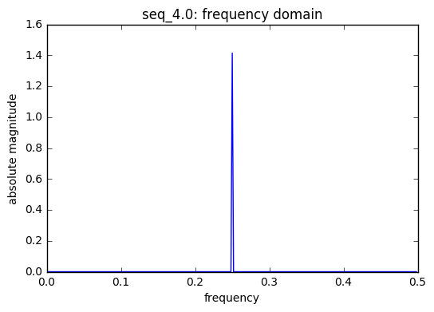


    frequencies used in  seq_4.0  :  [0.25]
    frequencies used in  seq_4.0  :  [0.25]
    threshold 0.366388975107
    frequencies  [[  0.00000000e+00   1.74900000e+03]
     [  1.40410959e-01   1.45612303e+02]
     [  1.42123288e-01   4.86725162e+02]
     [  1.43835616e-01   3.66081334e+02]
     [  1.45547945e-01   1.33506679e+02]
     [  2.85958904e-01   3.59556469e+02]
     [  4.28082192e-01   2.58631250e+02]]


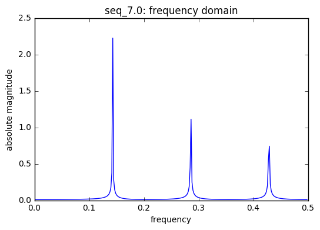


    frequencies used in  seq_7.0  :  [0.14285714285714285, 0.5, 0.33333333333333331]
    frequencies used in  seq_7.0  :  [0.14285714285714285, 0.5, 0.33333333333333331]


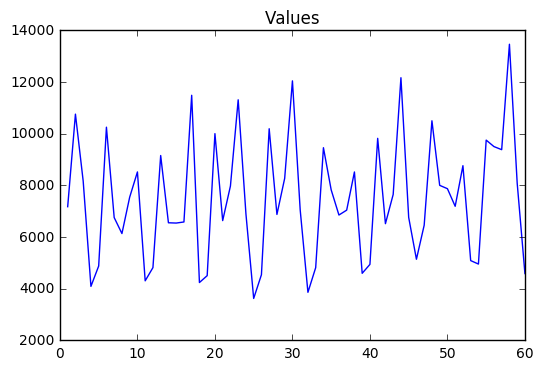


    SSE : 6016423835.35
    Baseline:  8816116516.19


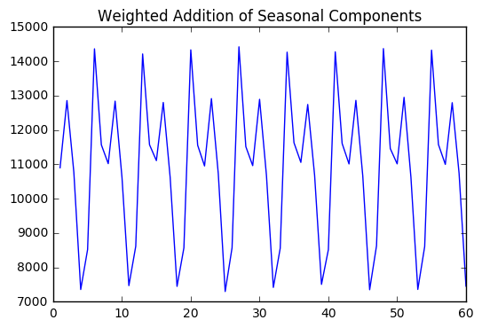


    coefficients: 
    [[  1.06821643e+04]
     [ -3.52788751e+01]
     [  4.47084285e+01]
     [ -5.51584196e+01]
     [  3.14098637e+00]
     [  1.34639433e+03]
     [ -5.91448274e+18]
     [ -2.32556407e+03]
     [  1.42799189e+03]
     [ -1.70555700e+03]
     [  1.16313398e+03]]


#### Weighted Addition of Seasonal Components

In the regression model, each of these components will get a weight associated with it which can be added together to create a weighted seasonal component. The weighted seasonal component has a pattern similar to that of the Pageviews. 

#### Finding peaks

There are two peaks which correspond to Monday and Thursday. This is consistent with the problem solution given above.


```python
peaks=[]
for i,xz in enumerate(x.dot(z)):
    if i>0 and i<len(x.dot(z))-1:
        if x.dot(z)[i]>x.dot(z)[i-1] and x.dot(z)[i]>x.dot(z)[i+1]:
            peaks.append(train['time'][i].isocalendar()[2])
print(set(peaks))
```

    {1, 4}


#### Training & Validation

The following models will be trained and validated with different seasonal variables:

1. Model fitted with a dummy coded weekday variable
2. Model fitted with extracted sinusodial compoenents


```python
y=train[['Pageviews']].values

m =len(train)

x=np.ones((m,8))
x[:,1:]=np.column_stack((train['W_2'],train['W_3'],
                         train['W_4'],train['W_5'],train['W_6'],
                         train['W_7'],train['sq_index']))


A=x.T.dot(x)
b=x.T.dot(y)
z = np.linalg.solve(A,b)

SSE=np.sum((y-x.dot(z))**2)
SST=sum((y-np.mean(y))**2)[0]
print("Training")
print("SSE: ",SSE)
print("SST: ",SST)
print("R^2: ",1-SSE/SST)
print("Baseline: ",sum((y-np.mean(y))**2)[0])

plt.plot(train['index'],y,'.')
plt.plot(train['index'],x.dot(z),'-')
plt.title("Dummy coded weekday variable: Training")
plt.show()

plt.scatter(train['index'],y-x.dot(z))
plt.title("Residuals")
plt.show()
print("coefficients:")
print(z)
print()

y=valid[['Pageviews']].values

m =len(valid)

x=np.ones((m,8))
x[:,1:]=np.column_stack((valid['W_2'],valid['W_3'],
                         valid['W_4'],valid['W_5'],valid['W_6'],
                         valid['W_7'],valid['sq_index']))


SSE=np.sum((y-x.dot(z))**2)
SST=sum((y-np.mean(y))**2)[0]
print("Validation")
print("SSE: ",SSE)
print("SST: ",SST)
print("R^2: ",1-SSE/SST)
print("Baseline: ",sum((y-np.mean(y))**2)[0])

plt.plot(valid['index'],valid[['Pageviews']],'.')
plt.plot(valid['index'],x.dot(z),'-')
plt.title("Dummy coded weekday variable: Validation")
plt.show()

plt.scatter(valid['index'],y-x.dot(z))
plt.title("Residuals")
plt.show()
```

    Training
    SSE:  1934277500.84
    SST:  8816116516.19
    R^2:  0.780597557066
    Baseline:  8816116516.19


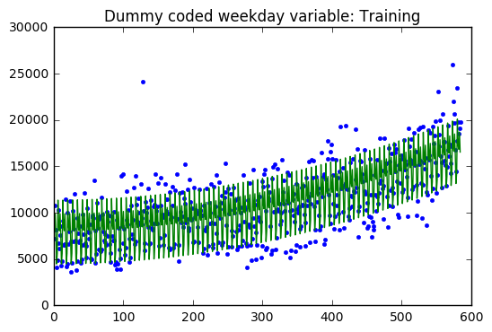


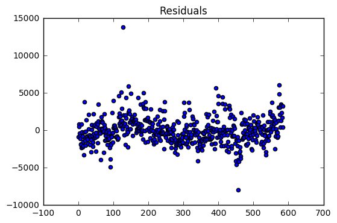


    coefficients:
    [[  1.13631136e+04]
     [ -2.77063946e+03]
     [ -3.30666190e+03]
     [ -1.48011158e+03]
     [ -3.67236320e+03]
     [ -6.88455158e+03]
     [ -5.73850886e+03]
     [  2.59656996e-02]]
    
    Validation
    SSE:  1150498879.42
    SST:  2421649439.03
    R^2:  0.524911054063
    Baseline:  2421649439.03


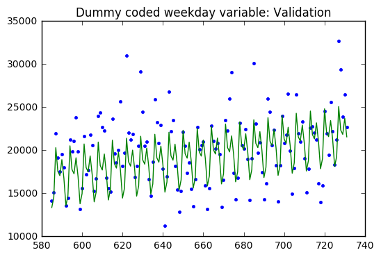


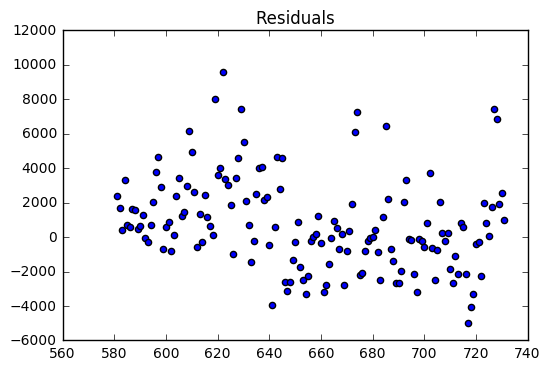


#### Results

The regression model on the training dataset had an R-Squared value of 0.78 with 8 predictor variables. The residual are evenly distributed around zero with a two large outliers. 

The validation dataset had an R-Squared of 0.52. The validation dataset residuals have many outliers compared the the training dataset residuals. In addition, there is a slight downward trend which suggests that a variable might be left out of the model.


```python
y=train[['Pageviews']].values

m,n =np.shape(train_x)
x=np.ones((m,n+3))
x=np.column_stack((train_x,train['index'],train['sq_index']))


A=x.T.dot(x)
b=x.T.dot(y)
z = np.linalg.solve(A,b)

SSE=np.sum((y-x.dot(z))**2)


SSE=np.sum((y-x.dot(z))**2)
SST=sum((y-np.mean(y))**2)[0]
print("SSE: ",SSE)
print("SST: ",SST)
print("R^2: ",1-SSE/SST)
print("Baseline: ",sum((y-np.mean(y))**2)[0])

plt.plot(train['index'],y,'.')
plt.plot(train['index'],x.dot(z),'-')
plt.title("Sinusoidal components: Training")
plt.show()

plt.scatter(train['index'],y-x.dot(z))
plt.title("Residuals")
plt.show()

print("coefficients:")
print(z)
print()

y=valid[['Pageviews']].values

m,n =np.shape(valid_x)
x=np.ones((m,n+3))
x=np.column_stack((valid_x,valid['index'],valid['sq_index']))


A=x.T.dot(x)
b=x.T.dot(y)
z = np.linalg.solve(A,b)
SSE=np.sum((y-x.dot(z))**2)
SST=sum((y-np.mean(y))**2)[0]

print("SSE: ",SSE)
print("SST: ",SST)
print("R^2: ",1-SSE/SST)
print("Baseline: ",sum((y-np.mean(y))**2)[0])

plt.plot(valid['index'],y,'.')
plt.plot(valid['index'],x.dot(z),'-')
plt.title("Sinusoidal components: Validation")
plt.show()

plt.scatter(valid['index'],y-x.dot(z))
plt.title("Residuals")
plt.show()
```

    SSE:  1929365771.24
    SST:  8816116516.19
    R^2:  0.781154687816
    Baseline:  8816116516.19


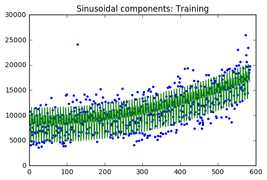


    coefficients:
    [[  7.92625860e+03]
     [ -2.64388157e+01]
     [  5.03642201e+01]
     [ -3.99517370e+01]
     [ -1.20650898e+01]
     [  1.32911733e+03]
     [ -5.91620396e+18]
     [ -2.31549084e+03]
     [  1.42755035e+03]
     [ -1.70319144e+03]
     [  1.14467396e+03]
     [ -1.83271991e+00]
     [  2.89026574e-02]]
    
    SSE:  744899756.645
    SST:  2421649439.03
    R^2:  0.692399839284
    Baseline:  2421649439.03


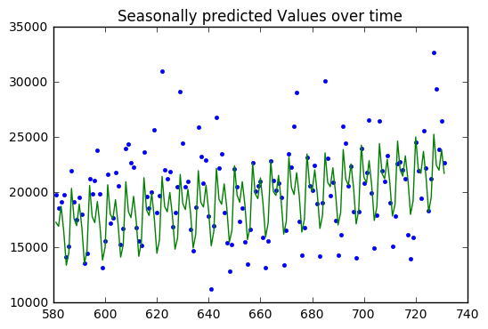


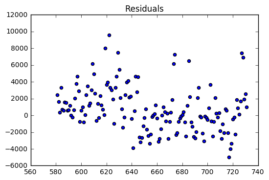


#### Results

The regression model on the training dataset had an R-Squared value of 0.78 with 13 predictor variables (3 sequences 6 frequencies 12 sinusoids). The residual are evenly distributed around zero with a two large outliers. 

The validation dataset had an R-Squared of 0.69. The validation dataset residuals seem to be evenly distributed with a handful of outliers compared to the training dataset residuals.

#### The results are almost (if not) exactly the same, so which method to choose?

Dummy coding can be automated, but its not always easy to type every variable to include in a linear model. In addition, it requires some inpection and trail and error to find the seasonal variable. The advantage of dummy coding is that each level is accounted for and it relatively easy to compare levels.

Signal processing can be used to create seasonal components almost automatically, but it is more computational expensive to calculate. In addition, it is not clear from the coefficients what the seasonal components are. The advantage is that there can be more predictive variables in the model, and the number of sinusodial components can be increased or decreased by adjusting the threshold or bandwith. 
