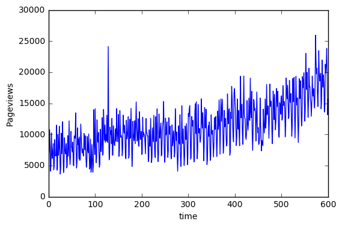

# How signal processing can be used to identify patterns in complex time series
#### by Rohan Kotwani

This was a fun, machine learning side project so I didn't have any business context to do it.

#### The original problem statement was given here: http://www.datasciencecentral.com/forum/topics/challenge-of-the-week-identifying-patterns-in-complex-time-series
There was also a verbal solution given in the members only section. I'm not sure if its legal to share the whole thing, but here is an excerpt of the solution. " The time series has a weekly periodicity with two peaks: Monday and Thursday, corresponding respectively to the publication of the Monday and Thursday digests. The impact of the Monday and Thursday email blasts extent over the next day; this makes measuring the yield more difficult, unless you use additional data, e.g. from our newsletter vendor. However, the bulk of the impact is really on Monday and Thursday."

I saw a DSC article that talked about finding trends using signal processing techniques. http://www.datasciencecentral.com/profiles/blogs/how-we-combined-different-methods-to-create-advanced-time-series . The trend component could be created and entered into the regression model as an independent variable. I should the trend component in one of the figures above. I think it wouldn't make sense to reuse frequencies components from the trend component because their periods (cycles/seconds) are very large (upwards of 200 days).

The trend and seasonality can be accounted for in a linear model by including sinusoidal components with a given frequency. However, finding the appropriate frequency for each sinusoidal component requires a little more digging. This post shows how to use fast Fourier transforms to find these frequencies.

#### Defining the model:
y = P(t) + S(t) + T(t) + R(t)

P(t)~Polynomial component
S(t)~Seasonal component
T(t)~Trend component
R(t)~Residual error

For the purposes of this post, we will only focus on the T(t) and S(t) components. The actual model fitting will be done in a separate post.

600 observations were used in the training set. The result was tested on the full dataset with 731 observations.





<div>
<table border="1" class="dataframe">
  <thead>
    <tr style="text-align: right;">
      <th></th>
      <th>Day</th>
      <th>Sessions</th>
      <th>Pageviews</th>
      <th>time</th>
      <th>index</th>
      <th>day</th>
      <th>sq_index</th>
      <th>weekday</th>
      <th>month</th>
      <th>seq1</th>
    </tr>
  </thead>
  <tbody>
    <tr>
      <th>0</th>
      <td>9/25/13</td>
      <td>4370</td>
      <td>7177</td>
      <td>2013-09-25</td>
      <td>1</td>
      <td>25</td>
      <td>1</td>
      <td>3</td>
      <td>9</td>
      <td>1</td>
    </tr>
    <tr>
      <th>1</th>
      <td>9/26/13</td>
      <td>5568</td>
      <td>10760</td>
      <td>2013-09-26</td>
      <td>2</td>
      <td>26</td>
      <td>4</td>
      <td>4</td>
      <td>9</td>
      <td>2</td>
    </tr>
    <tr>
      <th>2</th>
      <td>9/27/13</td>
      <td>4321</td>
      <td>8171</td>
      <td>2013-09-27</td>
      <td>3</td>
      <td>27</td>
      <td>9</td>
      <td>5</td>
      <td>9</td>
      <td>3</td>
    </tr>
    <tr>
      <th>3</th>
      <td>9/28/13</td>
      <td>2378</td>
      <td>4093</td>
      <td>2013-09-28</td>
      <td>4</td>
      <td>28</td>
      <td>16</td>
      <td>6</td>
      <td>9</td>
      <td>4</td>
    </tr>
    <tr>
      <th>4</th>
      <td>9/29/13</td>
      <td>2612</td>
      <td>4881</td>
      <td>2013-09-29</td>
      <td>5</td>
      <td>29</td>
      <td>25</td>
      <td>7</td>
      <td>9</td>
      <td>5</td>
    </tr>
  </tbody>
</table>
</div>


```python
def filter_trend(unfiltered,band,f_signal,threshold):
    filtered=[]
    for x,f in unfiltered:
        if np.absolute(f)>f_signal+band or np.absolute(f)<f_signal-band or (2.0/N *np.abs(x))<=threshold:
            pass
        else:
            filtered.append((f,x))
    return np.array(filtered)
```

#### Find the overall trend:
I used an FFT transformation to visualize the magnitude of the frequency components in the time series. To be specific, the absolute magnitude is plotted.


```python
yf = np.fft.fft(train['Pageviews'])
freq= np.fft.fftfreq(len(yf))
N=len(yf)
# xf = np.linspace(0.0, 1.0/(2.0*T), N/2)
y_abs=( 2.0/N * np.abs(yf[:N//2]))

plt.plot(freq[1:N//2],2.0/N * np.abs(yf[1:N//2]))
plt.show()


n=len(train)
F_unfiltered  = np.column_stack((yf[1:n//2],freq[1:n//2]))
print("Frequency, Magnitude")
print(np.absolute(filter_trend(F_unfiltered, 0.2,0.3,500)))
```


    Frequency, Magnitude
    [[  1.41666667e-01   1.82239797e+05]
     [  1.43333333e-01   5.67160341e+05]
     [  2.83333333e-01   1.66899918e+05]
     [  2.85000000e-01   4.59942544e+05]
     [  2.86666667e-01   3.95441559e+05]
     [  4.28333333e-01   2.03492985e+05]]


#### Does it make sense to reuse frequencies for the trend and seasonal components?
On one hand, it might be better not to miss anything. I doubt there will be a prominant trend for -a weekday- every 28 weeks.
For the trend component, it would makes sense to use the lowest frequencies with the highest magnitudes.

I found dominant frequencies at .143, .285, and .428. These correspond to T=7.14,3.5, and 2.33. The reason why those frequencies are interesting is because they are "sticking out." Which is shows there is probably a seasonal component that has a reasonable period, T (cycles/second). There were also some frequencies around the e-3 orders of magnitude. These were at .00166, .00333, and 0.005, T>200, which were included in the trend.


```python
n=len(train)

F_unfiltered  = np.column_stack((yf[1:n//2],freq[1:n//2]))

F_filtered = filter_trend(F_unfiltered, 0.05,0.055,1000)

signal=np.zeros(len(train))
t=np.arange(0,len(train))
t_full=np.arange(0,len(full))
signal_full=np.zeros(len(full))
for i,x in F_filtered:
    magnitude=np.absolute(x)/n
    f=np.absolute(i)
    phase=np.angle(x)
    signal+= magnitude * np.cos(2*np.pi*t*f+phase)
    signal_full+= magnitude * np.cos(2*np.pi*t_full*f+phase)
train['trend']=signal
full['trend']=signal_full

plt.scatter((np.absolute(F_filtered)[:,0]),
        (np.absolute(F_filtered)[:,1]))
plt.title("Frequencies included in the trend")
plt.show()

plt.plot(t,signal,'-')
plt.title('Trend component included the model')
plt.show()
```


This trend component would be entered into the regression model as an independent variable.

#### Finding seasonal patterns in the target variable:


```python
temp={}
temp['Pageviews_l']=[]
for t in range(len(train)):
    if t>0:
        #temp['Pageviews_l'+str(i)].append()
        temp['Pageviews_l'].append(train.ix[t]['Pageviews']-train.ix[t-1]['Pageviews'])
        #print(train.ix[t]['S'+str(i)]-train.ix[t-1]['S'+str(i)])
    else:
        temp['Pageviews_l'].append(0)
train['Pageviews_l']=temp['Pageviews_l']
plt.plot(train['index'],train['Pageviews_l'],'-')
plt.xlabel('time')
plt.ylabel('Pageviews')
plt.show()
```


The overall trend could be removed by creating a differenced variable for Pageviews The differenced variable allows for seasonal components to be identified more clearly.


```python
yf = np.fft.fft(train['Pageviews_l'])
freq= np.fft.fftfreq(len(yf))
# xf = np.linspace(0.0, 1.0/(2.0*T), N/2)
y_abs=( 2.0/N * np.abs(yf[:N//2]))

plt.plot(freq[1:N//2],2.0/N * np.abs(yf[1:N//2]))
plt.title("pageviews: frequency domain")
plt.show()

threshold = np.mean(2.0/N * np.abs(yf[1:N//2]))+2*np.std(2.0/N * np.abs(yf[1:N//2]))
n=len(train)
F_unfiltered  = np.column_stack((yf[1:n//2],freq[1:n//2]))

print("Frequency, Magnitude")
print(np.absolute(filter_trend(F_unfiltered, 0.2,0.3,threshold)))
```


    Frequency, Magnitude
    [[  1.43333333e-01   5.00831933e+05]
     [  2.83333333e-01   2.65832489e+05]
     [  2.85000000e-01   7.24904464e+05]
     [  2.86666667e-01   6.13035227e+05]
     [  2.88333333e-01   1.92922452e+05]
     [  4.28333333e-01   4.04206565e+05]]


The lower frequency components were removed and the other, distinct frequencies were amplified. This makes the frequencies easier to filter! Also it makes it easier to compare to possible seasonal variables.

#### Finding the seasonal predictor variable:


```python
for seasonal_component in seasonal_list:

    yf = np.fft.fft(train[seasonal_component])
    freq= np.fft.fftfreq(len(yf))
#     xf = np.linspace(0.0, 1.0/(2.0*T), N/2)
    y_abs=( 2.0/N * np.abs(yf[:N//2]))
    #Threshold is set to two standard deviations above mean
    threshold = np.mean(2.0/N * np.abs(yf[1:N//2]))+2*np.std(2.0/N * np.abs(yf[1:N//2]))
    plt.plot(freq[1:N//2],2.0/N * np.abs(yf[1:N//2]))
    plt.title(seasonal_component+": frequency domain")
    plt.show()


    n=len(train)
    F_unfiltered  = np.column_stack((yf[1:n//2],freq[1:n//2]))
    print(np.absolute(filter_trend(F_unfiltered, 0.299,0.3,threshold)))
```


    [[  1.41666667e-01   2.42782136e+02]
     [  1.43333333e-01   6.00386477e+02]
     [  1.45000000e-01   1.31981640e+02]
     [  2.85000000e-01   2.78344410e+02]
     [  2.86666667e-01   2.07887576e+02]
     [  4.28333333e-01   2.97539156e+02]]


#### Eureka! Weekday shares the same frequency components as Pageviews!
I found dominant frequencies at .143, .285, and .428. These correspond to T=7.14,3.5, and 2.33. There were also some frequencies around the e-3 orders of magnitude. These were at .00166, .00333, and 0.005 and had periods upwards of 200. 
If you want to see how I included these frequency components in a regression model please see my Github. The results are compared to straight up dummy coding (the results are the same).  


This table shows the index, weekday, and other time variables that will help me illustrate what I mean by periods or cycles.  My index starts at 1, but this corresponds to weekday 3 (or Wednesday). So index 6 corresponds to Monday and index 2 corresponds to Thursday. 


```python
weekday_dummies = pd.get_dummies(full.weekday, prefix='W').iloc[:, 1:]
full = pd.concat([full, weekday_dummies], axis=1)
full=full.sort_values(by=[time_component])
train=full[:600].copy()
valid=full[600:].copy()
train.head(n=10)
```


<div>
<table border="1" class="dataframe">
  <thead>
    <tr style="text-align: right;">
      <th></th>
      <th>Day</th>
      <th>Sessions</th>
      <th>Pageviews</th>
      <th>time</th>
      <th>index</th>
      <th>day</th>
      <th>sq_index</th>
      <th>weekday</th>
      <th>month</th>
      <th>seq1</th>
      <th>trend</th>
      <th>W_2</th>
      <th>W_3</th>
      <th>W_4</th>
      <th>W_5</th>
      <th>W_6</th>
      <th>W_7</th>
    </tr>
  </thead>
  <tbody>
    <tr>
      <th>0</th>
      <td>9/25/13</td>
      <td>4370</td>
      <td>7177</td>
      <td>2013-09-25</td>
      <td>1</td>
      <td>25</td>
      <td>1</td>
      <td>3</td>
      <td>9</td>
      <td>1</td>
      <td>304.221820</td>
      <td>0.0</td>
      <td>1.0</td>
      <td>0.0</td>
      <td>0.0</td>
      <td>0.0</td>
      <td>0.0</td>
    </tr>
    <tr>
      <th>1</th>
      <td>9/26/13</td>
      <td>5568</td>
      <td>10760</td>
      <td>2013-09-26</td>
      <td>2</td>
      <td>26</td>
      <td>4</td>
      <td>4</td>
      <td>9</td>
      <td>2</td>
      <td>257.168205</td>
      <td>0.0</td>
      <td>0.0</td>
      <td>1.0</td>
      <td>0.0</td>
      <td>0.0</td>
      <td>0.0</td>
    </tr>
    <tr>
      <th>2</th>
      <td>9/27/13</td>
      <td>4321</td>
      <td>8171</td>
      <td>2013-09-27</td>
      <td>3</td>
      <td>27</td>
      <td>9</td>
      <td>5</td>
      <td>9</td>
      <td>3</td>
      <td>209.818345</td>
      <td>0.0</td>
      <td>0.0</td>
      <td>0.0</td>
      <td>1.0</td>
      <td>0.0</td>
      <td>0.0</td>
    </tr>
    <tr>
      <th>3</th>
      <td>9/28/13</td>
      <td>2378</td>
      <td>4093</td>
      <td>2013-09-28</td>
      <td>4</td>
      <td>28</td>
      <td>16</td>
      <td>6</td>
      <td>9</td>
      <td>4</td>
      <td>162.235984</td>
      <td>0.0</td>
      <td>0.0</td>
      <td>0.0</td>
      <td>0.0</td>
      <td>1.0</td>
      <td>0.0</td>
    </tr>
    <tr>
      <th>4</th>
      <td>9/29/13</td>
      <td>2612</td>
      <td>4881</td>
      <td>2013-09-29</td>
      <td>5</td>
      <td>29</td>
      <td>25</td>
      <td>7</td>
      <td>9</td>
      <td>5</td>
      <td>114.485143</td>
      <td>0.0</td>
      <td>0.0</td>
      <td>0.0</td>
      <td>0.0</td>
      <td>0.0</td>
      <td>1.0</td>
    </tr>
    <tr>
      <th>5</th>
      <td>9/30/13</td>
      <td>5465</td>
      <td>10255</td>
      <td>2013-09-30</td>
      <td>6</td>
      <td>30</td>
      <td>36</td>
      <td>1</td>
      <td>9</td>
      <td>6</td>
      <td>66.630022</td>
      <td>0.0</td>
      <td>0.0</td>
      <td>0.0</td>
      <td>0.0</td>
      <td>0.0</td>
      <td>0.0</td>
    </tr>
    <tr>
      <th>6</th>
      <td>10/1/13</td>
      <td>3795</td>
      <td>6757</td>
      <td>2013-10-01</td>
      <td>7</td>
      <td>1</td>
      <td>49</td>
      <td>2</td>
      <td>10</td>
      <td>7</td>
      <td>18.734907</td>
      <td>1.0</td>
      <td>0.0</td>
      <td>0.0</td>
      <td>0.0</td>
      <td>0.0</td>
      <td>0.0</td>
    </tr>
    <tr>
      <th>7</th>
      <td>10/2/13</td>
      <td>3504</td>
      <td>6138</td>
      <td>2013-10-02</td>
      <td>8</td>
      <td>2</td>
      <td>64</td>
      <td>3</td>
      <td>10</td>
      <td>8</td>
      <td>-29.135918</td>
      <td>0.0</td>
      <td>1.0</td>
      <td>0.0</td>
      <td>0.0</td>
      <td>0.0</td>
      <td>0.0</td>
    </tr>
    <tr>
      <th>8</th>
      <td>10/3/13</td>
      <td>3997</td>
      <td>7546</td>
      <td>2013-10-03</td>
      <td>9</td>
      <td>3</td>
      <td>81</td>
      <td>4</td>
      <td>10</td>
      <td>9</td>
      <td>-76.918270</td>
      <td>0.0</td>
      <td>0.0</td>
      <td>1.0</td>
      <td>0.0</td>
      <td>0.0</td>
      <td>0.0</td>
    </tr>
    <tr>
      <th>9</th>
      <td>10/4/13</td>
      <td>4474</td>
      <td>8523</td>
      <td>2013-10-04</td>
      <td>10</td>
      <td>4</td>
      <td>100</td>
      <td>5</td>
      <td>10</td>
      <td>10</td>
      <td>-124.548159</td>
      <td>0.0</td>
      <td>0.0</td>
      <td>0.0</td>
      <td>1.0</td>
      <td>0.0</td>
      <td>0.0</td>
    </tr>
  </tbody>
</table>
</div>


#### Fitting the Model

I will include a P(t) component as the squared value of the index, sq_index, the trend component as T(t), and the seasonal components as S(t). Since T(t) and P(t) are already created, this part of the blog will focus on S(t).


```python
def get_freqlist(seasonal_component_,threshold):
    
    yf = np.fft.fft(seasonal_component_)
    freq= np.fft.fftfreq(len(yf))
#     xf = np.linspace(0.0, 1.0/(2.0*T), N/2)
    y_abs=( 2.0/N * np.abs(yf[:N//2]))
    #Threshold is set to two standard deviations above mean
    threshold = np.mean(2.0/N * np.abs(yf[1:N//2]))+2*np.std(2.0/N * np.abs(yf[1:N//2]))
    plt.plot(freq[1:N//2],2.0/N * np.abs(yf[1:N//2]))
    plt.title(seasonal_component+": frequency domain")
    plt.show()


    n=len(train)
    F_unfiltered  = np.column_stack((yf[1:n//2],freq[1:n//2]))
    print(np.absolute(filter_trend(F_unfiltered, 0.299,0.3,threshold)))
```


```python
seasonal_list = ['weekday']
```


```python
input_df2=train[seasonal_list]
output=train[['Pageviews']]
y=output.values
input_=input_df2.values
m,n =np.shape(input_)
x=input_

frequency_components=np.array([.1433,.2855,.428])
frequency_components = 2*np.pi*np.outer(frequency_components,np.ones(x.shape[1])).reshape((len(frequency_components),x.shape[1]))

trig_args = np.dot(frequency_components,x.T ).T
seasonal_x = np.column_stack((np.sin(trig_args),np.cos(trig_args)))


# print(seasonal_x)
# plt.plot(train['index'],y,'.')


plt.plot(train['index'][:10],seasonal_x[:10,0]+seasonal_x[:10,3],'-')
plt.title("The first seasonal component")
plt.show()
plt.plot(train['index'][:10],seasonal_x[:10,1]+seasonal_x[:10,4],'-')
plt.title("The second seasonal component")
plt.show()
plt.plot(train['index'][:10],seasonal_x[:10,2]+seasonal_x[:10,5],'-')
plt.title("The third seasonal component")
plt.show()
```


Each seasonal component is made up of two sinusoidal waves, i.e. β1*sin(t/T) + β2*cos(t/T). The cosine term is include to account for phase shift. The beta coefficients are the estimated parameter weights for each sinusoid. Since 3 frequencies are included in the model, there will be 6 sinusoids and 6 beta coefficients to estimate. For the time component, t, I used the actual "weekday" variable.

In the regression model, each of these components will get a weight associated with it. When all of them are added up together with their respective weights, you should see a pattern similar to Pageviews.


```python
plt.plot(train['index'][:20],train['Pageviews'][:20],'-')
plt.title("Pageviews")
plt.show()


m,n =np.shape(seasonal_x)
print(m,n)
# print(seasonal_x)
# x=np.ones((m,n+3))
# x[:,1:]=np.column_stack((seasonal_x,train['trend'],train['sq_index']))
x=np.ones((m,n+1))
x[:,1:]=seasonal_x


A=x.T.dot(x)
b=x.T.dot(y)
z = np.linalg.solve(A,b)

SSE=np.sum((y-x.dot(z))**2)
print("SSE :",SSE)
print("Baseline: ",sum((y-np.mean(y))**2)[0])

# plt.plot(train['index'],y,'.') 
plt.plot(train['index'][:20],x.dot(z)[:20],'-')
plt.title("Weighted Addition of Seasonal Components")
plt.show()
```


    600 6
    SSE : 6919007526.26
    Baseline:  9765197379.99


There are two peaks at indexes 2 and 6 which correspond to Monday and Thursday. This is consistent with the problem solution given above.

#### Training Data

The model was fitted on the training set with 600 observations. Its interesting that the model fitted with sinusoids gave almost the same R-squared value as including a dummy coded weekday variable in the model. The coefficients are obviously much different, but the results are eerily similar.

#### Model fitted with sinusoid terms:


```python
input_df2=train[seasonal_list]
output=train[['Pageviews']]
y=output.values
input_=input_df2.values
m,n =np.shape(input_)
x=input_

frequency_components=np.array([.1433,.2855,.428])
frequency_components = 2*np.pi*np.outer(frequency_components,np.ones(x.shape[1])).reshape((len(frequency_components),x.shape[1]))

trig_args = np.dot(frequency_components,x.T ).T
seasonal_x = np.column_stack((np.sin(trig_args),np.cos(trig_args)))

m,n =np.shape(seasonal_x)
# print(seasonal_x)
# x=np.ones((m,n+3))
# x[:,1:]=np.column_stack((seasonal_x,train['trend'],train['sq_index']))
x=np.ones((m,n+3))
x[:,1:]=np.column_stack((seasonal_x,train['trend'],train['sq_index']))


A=x.T.dot(x)
b=x.T.dot(y)
z = np.linalg.solve(A,b)

SSE=np.sum((y-x.dot(z))**2)
print("SSE :",SSE)
print("Baseline: ",sum((y-np.mean(y))**2)[0])
```

    SSE : 1824619798.78
    Baseline:  9765197379.99


```python
SSE=np.sum((y-x.dot(z))**2)
SST=sum((y-np.mean(y))**2)[0]
print("SSE: ",SSE)
print("SST: ",SST)
print("R^2: ",1-SSE/SST)


plt.plot(train['index'],y,'.')
plt.plot(train['index'],x.dot(z),'-')
plt.title("Seasonally predicted Pageviews over time")
plt.show()
print("Coefficients:")
z
```

    SSE:  1824619798.78
    SST:  9765197379.99
    R^2:  0.813150750796


    Coefficients:


    array([[  8.10030680e+03],
           [  1.55909280e+03],
           [  2.23320858e+03],
           [  1.52632878e+02],
           [ -1.26500151e+03],
           [ -3.93921325e+02],
           [ -7.03090816e+02],
           [  7.94011068e-01],
           [  2.50742897e-02]])


```python
peaks=[]
for i,xz in enumerate(x.dot(z)):
    if i>0 and i<len(x.dot(z))-1:
        if x.dot(z)[i]>x.dot(z)[i-1] and x.dot(z)[i]>x.dot(z)[i+1]:
            peaks.append(train['time'][i].isocalendar()[2])
# print("peaks: ",np.unique(peaks))

```


```python
plt.scatter(train['index'],y-x.dot(z))
plt.show()
```


The residual plot is not indicative of a major seasonal pattern. There is a slight hump at the begining that levels off and increases slightly toward the end.

#### Validation


```python

input_df2=valid[seasonal_list]
output=valid[['Pageviews']]
y=output.values
input_=input_df2.values
m,n =np.shape(input_)
x=input_

frequency_components=np.array([.1433,.285,.428])
frequency_components = 2*np.pi*np.outer(frequency_components,np.ones(x.shape[1])).reshape((len(frequency_components),x.shape[1]))

trig_args = np.dot(frequency_components,x.T ).T
seasonal_x = np.column_stack((np.sin(trig_args),np.cos(trig_args)))

# m,n =np.shape(seasonal_x)
m,n =np.shape(seasonal_x)
# print(seasonal_x)
x=np.ones((m,n+3))
x[:,1:]=np.column_stack((seasonal_x,valid['trend'],valid['sq_index']))

SSE=np.sum((y-x.dot(z))**2)
SST=sum((y-np.mean(y))**2)[0]
print("SSE: ",SSE)
print("SST: ",SST)
print("R^2: ",1-SSE/SST)

plt.plot(valid['index'],valid[['Pageviews']],'.')
plt.plot(valid['index'],x.dot(z),'-')
plt.title("Seasonally predicted Pageviews over time")
plt.show()


```

    SSE:  1283531844.75
    SST:  2180040128.7
    R^2:  0.41123476222


```python
plt.scatter(valid['index'],y-x.dot(z))
plt.show()
```


There is a slightly overall trend in the residual plot. Including lower frequency components could help stablize errors.

#### How does this measure up to dummy coding the weekday variable?

#### Model fitted with dummy coded weekday:


```python
input_df2=train[seasonal_list]
output=train[['Pageviews']]
y=output.values
input_=input_df2.values
m,n =np.shape(input_)
x=input_

x=np.ones((m,9))
x[:,1:]=np.column_stack((train['W_2'],train['W_3'],
                         train['W_4'],train['W_5'],train['W_6'],
                         train['W_7'],train['trend'],train['sq_index']))


A=x.T.dot(x)
b=x.T.dot(y)
z = np.linalg.solve(A,b)

SSE=np.sum((y-x.dot(z))**2)
SST=sum((y-np.mean(y))**2)[0]
print("SSE: ",SSE)
print("SST: ",SST)
print("R^2: ",1-SSE/SST)


# plt.plot(train['index'],y,'.')
# plt.plot(train['index'],x.dot(z),'-')
# plt.title("Seasonally predicted Pageviews over time")
# plt.show()

# plt.scatter(train['index'],y-x.dot(z))
# plt.show()
print("Coefficients:")
z
```

    SSE:  1824619798.78
    SST:  9765197379.99
    R^2:  0.813150750796
    Coefficients:


    array([[  1.15000991e+04],
           [ -2.75598163e+03],
           [ -3.28854678e+03],
           [ -1.44911713e+03],
           [ -3.65450388e+03],
           [ -6.91319555e+03],
           [ -5.75584347e+03],
           [  7.94011068e-01],
           [  2.50742897e-02]])


#### Validation


```python
input_df2=valid[seasonal_list]
output=valid[['Pageviews']]
y=output.values
input_=input_df2.values
m,n =np.shape(input_)
x=input_

x=np.ones((m,9))
x[:,1:]=np.column_stack((valid['W_2'],valid['W_3'],
                         valid['W_4'],valid['W_5'],valid['W_6'],
                         valid['W_7'],valid['trend'],valid['sq_index']))


SSE=np.sum((y-x.dot(z))**2)
SST=sum((y-np.mean(y))**2)[0]
print("SSE: ",SSE)
print("SST: ",SST)
print("R^2: ",1-SSE/SST)


plt.plot(valid['index'],valid[['Pageviews']],'.')
plt.plot(valid['index'],x.dot(z),'-')
plt.title("Seasonally predicted Pageviews over time")
plt.show()

plt.scatter(valid['index'],y-x.dot(z))
plt.show()
```

    SSE:  1280695316.78
    SST:  2180040128.7
    R^2:  0.412535897884


#### The results are almost (if not) exactly the same, so which method to choose?
Dummy coding is one thing that can be automated, but its not always easy to type every variable to include in a linear model. The advantage of dummy coding is that its more difficult to go wrong with because each level is accounted for. Using signal processing, frequencies need to be chosen for the seasonal components which requires some inspection and maybe some trail and error. The plus side is that you can choose which periods make sense and you can choose frequencies for trend component while you work on the seasonal part.
All in all, both methods ended up with the same number of parameters and had the same performance.


```python

```
